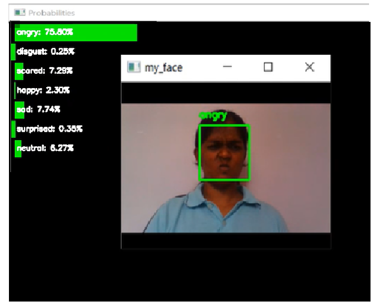
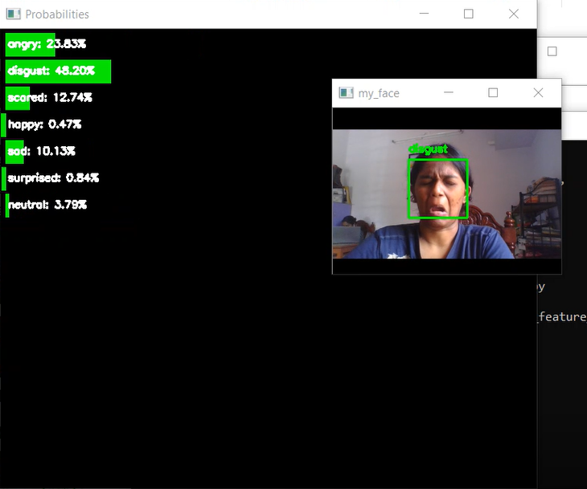
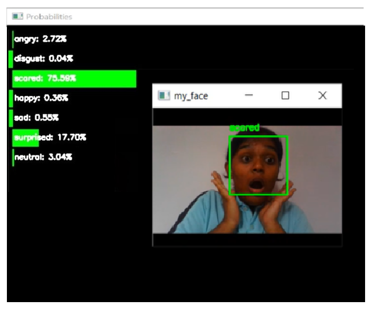
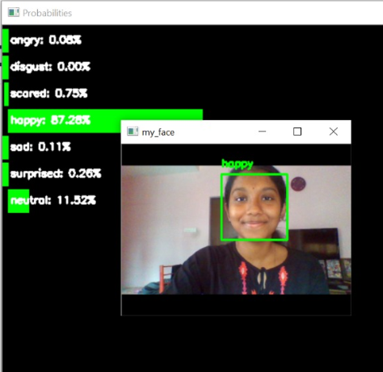
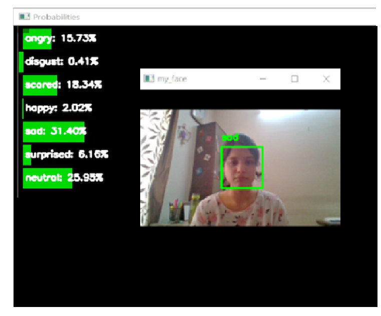
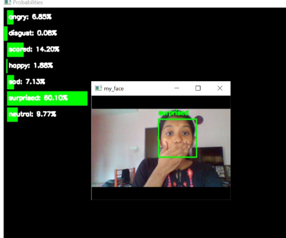
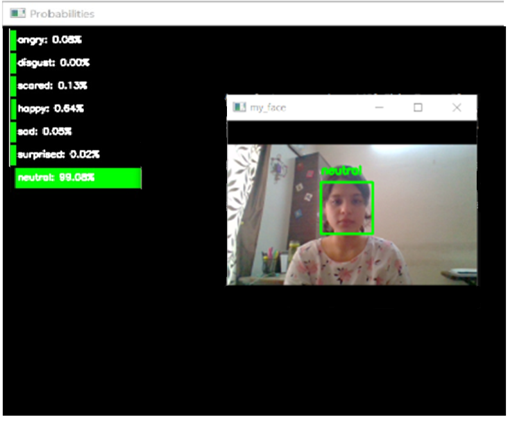
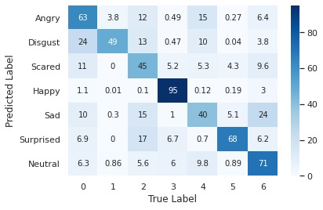
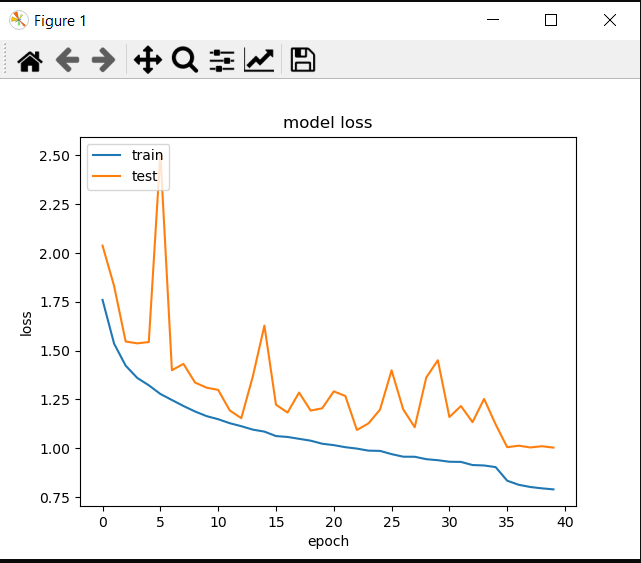

# Emotion Analytics Using Facial Emotion Recognition (FER)

This repository presents the implementation of an automated system for analyzing facial emotions during video conferencing meetings. By leveraging advanced Facial Emotion Recognition (FER) techniques, the system aims to provide actionable insights into participant engagement and emotional states in real time.

---

## Team Members

This project was developed by:
- **Cindrella S.K.**
- **Afridha M.**
- **Anvita Ashokkumar**

---

## Problem Statement

Virtual meetings have become a ubiquitous tool for professional and personal communication. However, the absence of physical cues poses a significant challenge in assessing participant engagement and emotional feedback. This project addresses the following challenges:
- Automatically detecting and classifying facial expressions from video streams.
- Generating quantitative insights into participant emotions throughout the duration of a meeting.

---

## Dataset

- **Dataset**: [FER-2013](https://www.kaggle.com/datasets/msambare/fer2013)
  - **Source**: Facial Expression Recognition Challenge, ICML 2013 Workshop.
  - **Description**:
    - Comprises 36,887 grayscale images with a resolution of 48x48 pixels.
    - Each image is labeled with one of seven basic emotions: anger, disgust, fear, happiness, sadness, surprise, or neutrality.
    - **Training Data**: 28,709 images.
    - **Validation Data**: 3,589 images.
    - **Testing Data**: 3,589 images.

> You can download the dataset from [Kaggle's FER-2013 Dataset Page](https://www.kaggle.com/datasets/msambare/fer2013).

---

## Proposed Solution

### **Methodology**
1. **Face Detection**:
   - Implemented using the Haar-Cascade Classifier in OpenCV, which identifies faces in real time by analyzing grayscale pixel values.
2. **Emotion Recognition**:
   - Utilizes a convolutional neural network (CNN) based on the Xception architecture, trained on the FER-2013 dataset.
3. **Analytics**:
   - Generates comprehensive reports summarizing the distribution of emotions over the course of a meeting.

### **System Workflow**
1. Preprocessing:
   - Converts video frames to grayscale.
   - Applies Haar-Cascade for face detection and data augmentation for robust model training.
2. Model Training:
   - Trains the Xception model to classify facial expressions with high accuracy.
3. Real-Time Analysis:
   - Processes live video streams to detect emotions and compiles analytics reports.

---

## Results

### **Model Performance**
- **Training Accuracy**: 81% on FER-2013.
- **Metrics**: Accuracy, precision, recall, and F1-score calculated using a confusion matrix.

### **Visualization of Results**

- **Emotion Classification Examples**:
  - The following images showcase the system's ability to classify different emotions from the FER-2013 dataset:
  
| Emotion       | Example Image                       |
|---------------|-------------------------------------|
| **Angry**     |         |
| **Disgusted** | |
| **Fear**      |           |
| **Happy**     |         |
| **Sad**       |             |
| **Surprise**  |   |
| **Neutral**   |     |


- **Performance Metrics**:
  - **Confusion Matrix**:
    
  - **Accuracy Graph**:
    
  - **Loss Graph**:
    


## References

1. **FER-2013 Dataset**: Facial Expression Recognition Challenge, ICML 2013 Workshop.
2. François Chollet, *Xception: Deep Learning with Depthwise Separable Convolutions*.
3. Paul Viola and Michael Jones, *Rapid Object Detection using a Boosted Cascade of Simple Features*.

---

## Citation

If you use this work in your research or projects, please cite:
```bibtex
@misc{video-conferencing-fer,
  author = { Cindrella S.K, Afridha M., Anvita Ashokkumar},
  title = {Video Conferencing Meet Analytics Using Facial Emotion Recognition},
  year = {2021},
}

